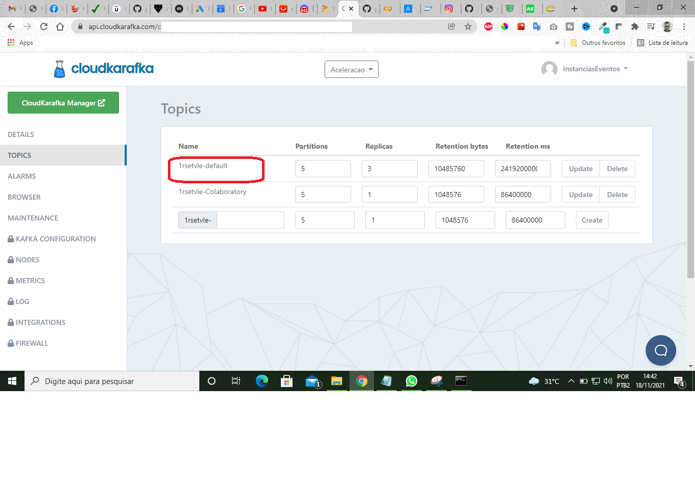
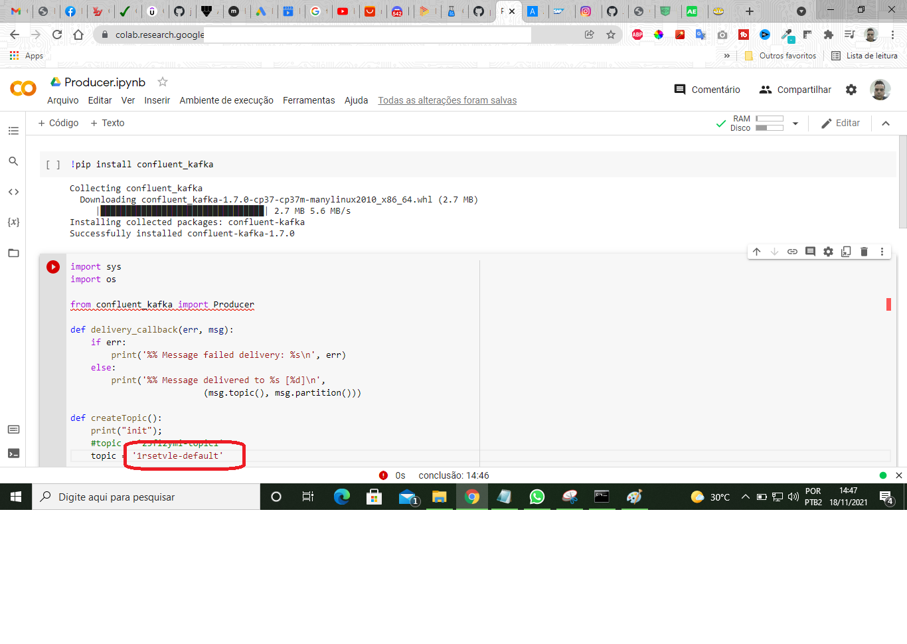
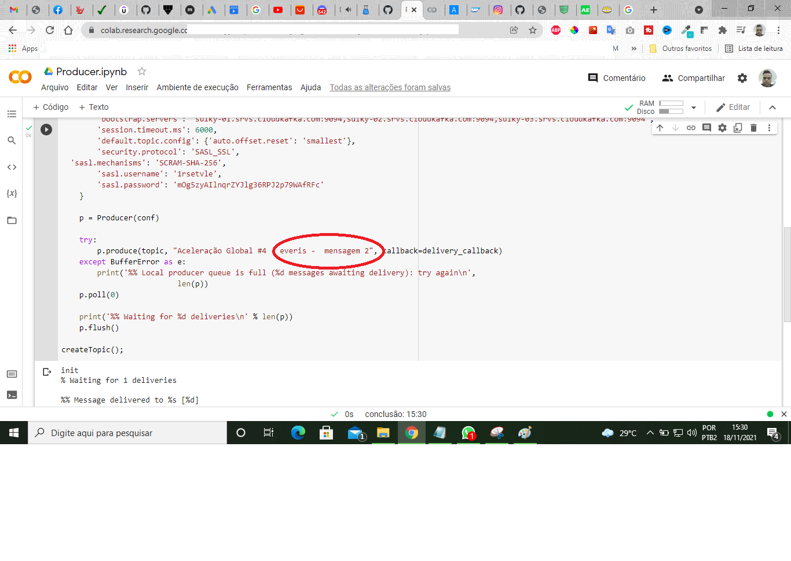
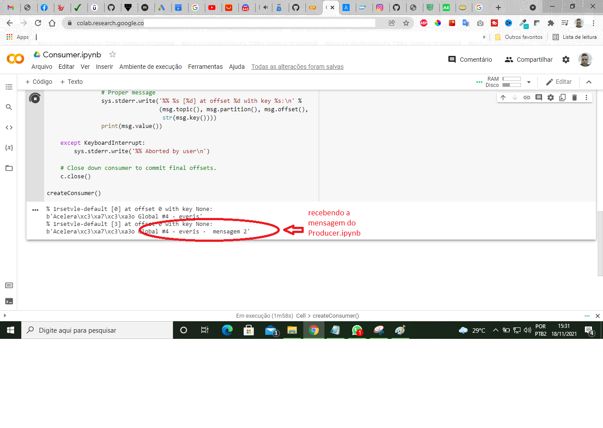

## Introdução à Mensageria na Nuvem Com Kafka e Python - Digital Innovation

**Aluno:** Joanes Cavalcanti de Araújo 

**Prof:** Hugo de Oliveira Alves

## Descrição

Nós temos o broker, temos o Produtor **(Producer.ipynb)** que envia as mensagens e você tem o tópico, o tópico vai estar dentro do ‘cluster’ armazenando todas as mensagens e os consumidores **(Consumer.ipynb)** ficam recebendo em ‘loop’.

## Imagens

Obrigado :)
